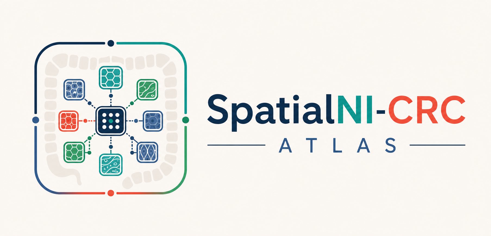
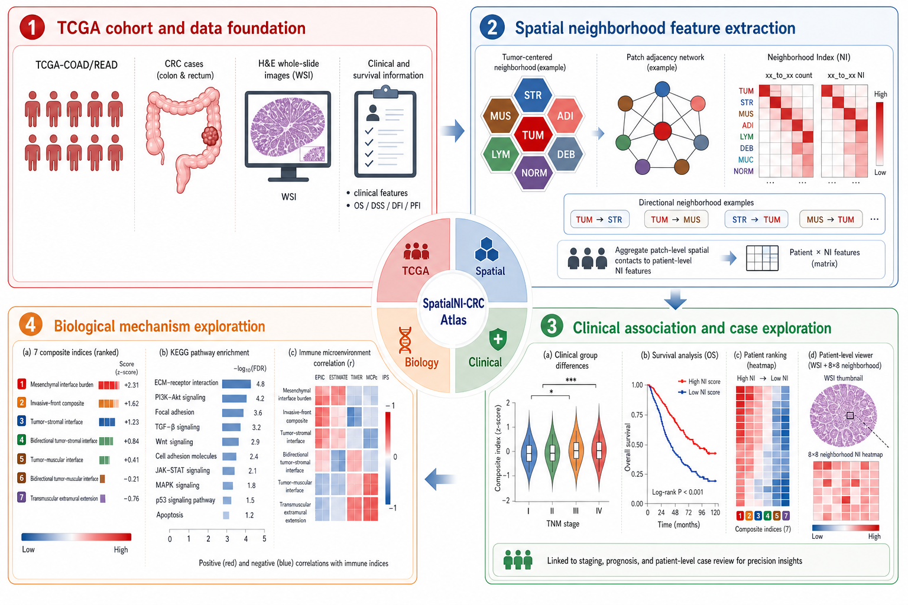

# SpatialNI-CRC

<p align="center">
  
</p>

**SpatialNI-CRC** is a computational pathology framework for transforming
routine H&E whole-slide images into interpretable, patient-level spatial
neighbourhood indices in colorectal cancer.

Instead of asking only *how much* tumour, stroma, muscle, adipose tissue,
lymphocyte-rich tissue, mucus, debris or normal mucosa is present, SpatialNI
asks a directional pathology question:

> **Which tissue compartments locally surround each other, and how do these
> neighbourhood states remodel during colorectal cancer progression?**

The framework converts patch-resolved WSI tissue maps into directional
neighbourhood matrices, composite interface scores, clinical association
statistics, survival models, transcriptomic correlations and spatial-omics
mechanistic readouts.

## Why SpatialNI-CRC?

- **Turns routine H&E architecture into quantitative spatial biomarkers**  
  SpatialNI translates familiar pathology concepts, including tumour glands facing stroma,
  tumour approaching smooth muscle, adipose-associated extension and
  invasive-front organization, into reproducible patient-level neighbourhood
  indices.

- **Measures directionality instead of simple tissue abundance**  
  The framework asks not only how much tumour, stroma or muscle is present, but
  which tissue states are locally embedded within one another. Reciprocal
  features such as `TUM_to_STR_NI` and `STR_to_TUM_NI` capture complementary
  views of the same tumour-stromal interface.

- **Scales to multicentre WSI cohorts**  
  The manuscript applies SpatialNI to 1,549 patients from four institutional CRC
  cohorts and TCGA, enabling cross-cohort evaluation of spatial tissue
  architecture, progression, prognosis and molecular microenvironmental states.

- **Reveals a progression model of interface expansion**  
  SpatialNI identifies a reproducible transition from tumour self-neighbourhoods
  toward expanded tumour-stromal, tumour-muscular and adipose-associated
  interfaces, providing a spatial readout of invasive-front remodelling.

- **Summarizes invasive architecture with pathology-informed composite indices**  
  Composite scores capture mesenchymal interface burden, tumour-stromal
  coupling, tumour-muscular interfaces, transmuscular extension and
  invasive-front remodelling in compact, interpretable patient-level metrics.

- **Connects morphology to clinical and molecular phenotypes**  
  SpatialNI features track T, N, M and TNM progression, stratify overall
  survival, support hypothesis-generating treatment-associated subgroup
  analyses, and link high interface-burden states to stromal activation,
  immune-contexture remodelling and spatial transcriptomic programmes at
  tumour-stromal interfaces.

- **Provides a reusable digital atlas**  
  The SpatialNI-CRC Atlas exposes index definitions, distributions, clinical
  associations, survival analyses, molecular correlations and representative
  cases through a browser-based interface for transparent exploration and
  external validation.

## SpatialNI-CRC Atlas

The **SpatialNI-CRC Atlas** is an interactive web resource for exploring the
SpatialNI feature system and its clinical and biological associations:

**Website:** http://www.spatialni-crc-atlas.cn/

The atlas provides browser-based modules for:

- study overview and cohort-level summaries
- spatial-index definitions and tissue-pair interpretation
- clinical association heatmaps and endpoint-specific feature exploration
- survival analysis and patient stratification
- transcriptomic and immune-contexture correlation modules
- representative WSI cases and patient-level neighbourhood maps
- downloadable plots and source tables where available

<p align="center">
  
</p>

## Repository Purpose

This repository provides the public, reproducible core of the SpatialNI
analysis workflow. It is intended for readers who want to understand, inspect
and rerun the main computational steps from WSI processing to patient-level
SpatialNI feature generation and downstream association analysis.

The public release keeps the method portable and readable. It removes private
cohort file layouts, local infrastructure and figure-assembly code, while
preserving the core algorithms and software structure used by the manuscript.

## Reproducible Workflow

Run the code in the following order.

### Step 01 - WSI preprocessing

`wsi_preprocessing.py`

- opens whole-slide images with TIAToolbox
- defines Otsu-masked tissue regions
- extracts a non-overlapping 512 x 512 patch grid at 20x power
- preserves patch coordinates for spatial reconstruction

### Step 02 - Patch classification

`patch_classification.py`

- performs Reinhard stain normalization by default
- classifies patches with TIAToolbox `PatchPredictor`
- uses the Kather100K `wide_resnet101_2` pathology model
- outputs patch-level tissue labels and probabilities

Patch classes:

```text
BACK, NORM, DEB, TUM, ADI, MUC, MUS, STR, LYM
```

### Step 03 - SpatialNI feature construction

`spatialni_feature_engine.py`

- reconstructs the classified WSI patch map
- evaluates the eight adjacent positions in a 3 x 3 patch window
- counts directional source-to-target neighbourhood events
- normalizes counts into patient-level NI values
- derives composite interface scores
- exports WSI patch class maps

### Step 04 - Progression and survival analysis

`progression_and_survival_analysis.py`

- binary endpoint association testing
- logistic-effect estimation and fixed-effect meta-analysis
- Kaplan-Meier and Cox proportional-hazards analyses
- time-dependent AUC, C-index and calibration helpers

### Step 05 - Transcriptomics and spatial-omics integration

`transcriptomics_and_spatial_omics.py`

- patient-level SpatialNI and molecular table integration
- interface-versus-background comparisons
- spatial neighbour-edge construction
- cell-state weight handling
- ligand-receptor score calculation

R-side workflows:

- `transcriptomics_iobr_signatures.R`
- `transcriptomics_iobr_multimethod.R`

These scripts provide the immune/signature estimation layer used for bulk
transcriptomic integration.

## Minimal WSI-to-SpatialNI Example

See `example_usage.md` for a compact runnable example.

Expected outputs:

- `patch_predictions.csv`
- `patient_spatialni.csv`
- `wsi_patch_class_map.png`

Minimal expected layout:

```text
code/github/
  wsi/
    TCGA-A6-2676-01Z-00-DX1.c465f6e0-b47c-48e9-bdb1-67077bb16c67.svs
  reference/
    reference_patch.jpg
  outputs/
```

Reinhard stain normalization is the default. Provide a representative H&E
reference patch at `reference/reference_patch.jpg`, or explicitly set
`stain_normalization=False` for a quick end-to-end software test.

## Core Method Definition

For each classified source patch, SpatialNI evaluates the eight immediately
adjacent grid positions. A target tissue category is counted once per source
patch if at least one adjacent patch of that category exists. Patient-level NI
features are then calculated as:

```text
source_to_target_NI =
    number of source patches with at least one target neighbour
    -----------------------------------------------------------
    total number of source patches
```

This produces a tissue-by-neighbour matrix that remains interpretable in
standard pathology language while being suitable for patient-level statistical
analysis.

## Scope and Citation

This repository is a method-focused code release for SpatialNI-CRC. The
SpatialNI-CRC Atlas is available at:

http://www.spatialni-crc-atlas.cn/

If you use this code, please cite the associated SpatialNI-CRC manuscript once
available.
